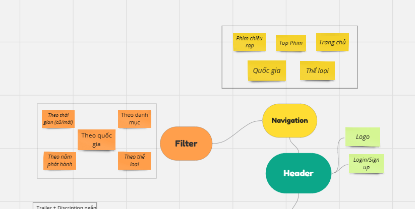
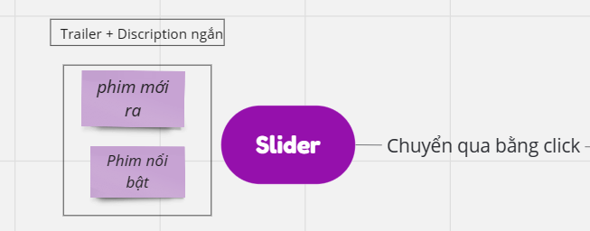
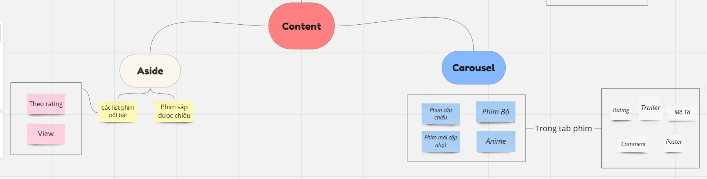
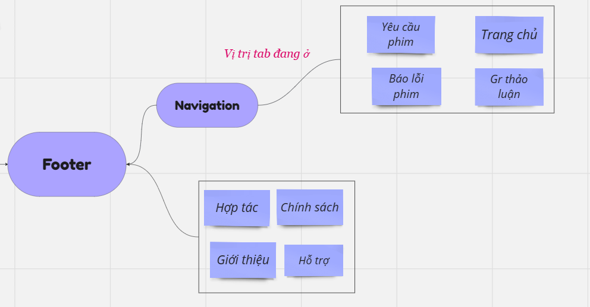

# LAZYFILMS 
## Hình ảnh thiết kế web
:point_right:[Github Pages](https://vtnghidevops.github.io/LazyFilms-Web/)

### **Header**

### **Slider**

### **Content**

### **Footer**

# Detail

## I.Header

### 1 Navigation

#### 1.1 Thể loại
- Các thể loại phim tương ứng với 1 tab phim theo thể loại tương ứng.

#### 1.2 Quốc gia
- Phim theo quốc gia.

#### 1.3 Top Phim
- Các phim đứng **top theo tuần.**

#### 1.4 Phim Chiếu rạp
- Tab phim được chiếu rạp (bao gồm **phim mới có trailer + phim đã chiếu**).

- **Với mỗi tab phim gồm *"filter"* tìm kiếm theo:**
  - **Thời gian:** Mới, Cũ.
  - **Danh mục:** Phim lẻ, bộ.
  - **Thể loại:** Nhiều loại thể loại (Hài, gây cấn, hành động, kinh dị, ...).
  - **Quốc gia:** Ấn, Âu Mĩ,..
  - **Năm phát hành:** Theo năm ra phim.

#### 1.5 Khung tìm kiếm
- Tìm kiếm theo **keyword** phim.

#### 1.6 Login
- **Với Guest:**
  - Xem phim thông thường + Có quảng cáo khi xem.
- **Với chế độ VIP:**
  - Xem phim không quảng cáo, có lưu lịch sử xem, đánh dấu phim yêu thích, Thông báo về account về phim mới.

## II. Slider 
- Có **trailer phim** + Đoạn **mô tả ngắn** về phim (Ngẫu nhiên), Với các phim mới , view cao 

## III. Content
### 1. Carousel
**Các list phim bao gồm:**
- **Phim mới cập nhật.**
- **Phim Bộ.**
- **Anime.**
- **Sắp chiếu.**

**Trong từng phim:**
- Có các khu vực **bình luận** tăng tính tương tác giữa các người dùng với nhau.
- Các mô tả **chi tiết về phim, đánh giá phim.**
- Phim liên quan.

### 2. Aside
- Các list phim nổi bật **theo tuần, rating cao + view.**
- Phim **sắp** được chiếu trên web.

## IV. Footer

### 1. Navigation
- **Báo lỗi:** Giúp người xem *báo lỗi* các phim đến ad để **fix lỗi.**
- **Yêu cầu phim** (Tính năng dành cho **VIP**): Yêu cầu các phim.
- **Group thảo luận phim.**

### 2. Phần còn lại
- Các **mô tả cơ bản** về trang web cơ bản: chính sách, giới thiệu, hỗ trợ quảng cáo.
- Link các trang xã hội của web.

