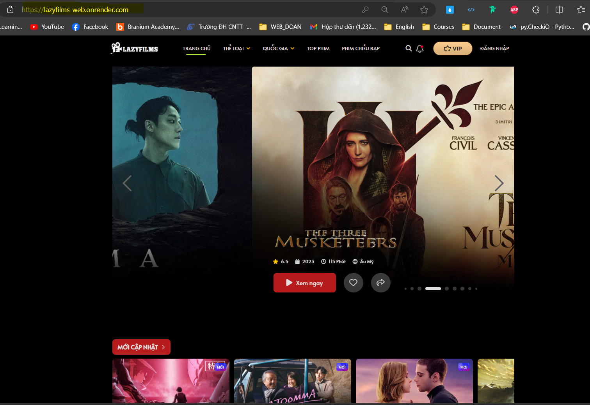
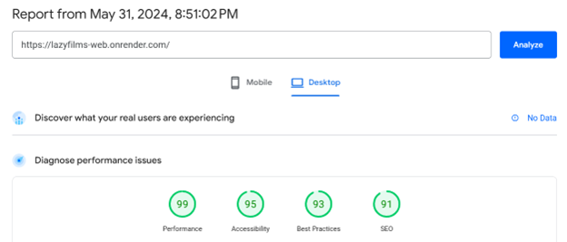
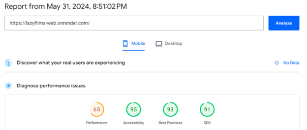
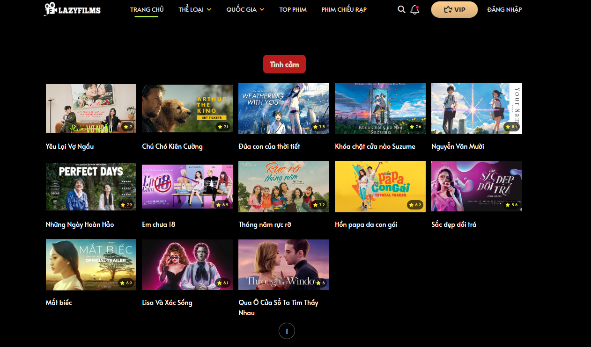
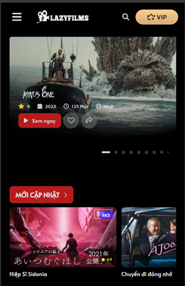

### **Hướng dẫn cài đặt môi trường**


**1. Cài đặt Node.js**
Tải `Node.js` từ trang web chính thức <a> [node.js](https://nodejs.org/en/download/package-manager)
Cài đặt `Node.js` theo hướng dẫn trên trang web.
**2. Clone project**
Tạo **thư mục** để chứa toàn bộ source code , mở`git bash` nay tại thư mục vừa tạo , sau đó clone project bằng lệnh:
```
git clone https://github.com/vtnghidevops/LazyFilms-Web.git
```
**3. Cài đặt package**

Mở thư mục `Backend` bằng công cụ code editor (Visual Studio Code).
Vào `terminal` và gõ lệnh:
```
npm install
```
**4. Khởi động server**

Vào `terminal` và gõ lệnh:
```
node app.js
```
<span style="color:blue;font-weight: 600">Note:</span> Nếu ta thấy 2 dòng **“Server is running on port 3000”** và **“Connected to MongoDB”** là thành công</p>


**5. Truy cập website**

Mở trình duyệt web và truy cập địa chỉ: **“localhost:3000”** để tới website local

### Các Tính năng Website
**Website hỗ trợ các tính năng :**
- Login/Logout
- Xem phim trực tuyến
- Tìm kiếm phim theo tên, thể loại, quốc gia
- Bình luận phim
- Thay đổi thông tin cá nhân/ Password,..
- Nhận thông báo phim mới
- Chia sẻ phim
- Đánh dấu phim yêu thích
- Xem lịch sử xem phim
- Tắt đèn khi xem phim
- Báo cáo phim khi có lỗi
## Danh sách thành viên nhóm

| Tên | Chức vụ | MSSV |
|:-------- |:--------:| --------:|
| Vương Tấn Nghị     |  Nhóm trưởng   | 22520942 |
| Đỗ Thiện Khang     |   Thành viên   | 22520608 |
| Nguyễn Vũ Phi Long     |   Thành viên   | 22520820 |
| Trần Thiện Mạnh    |   Thành viên   | 22520853 |
| Trang Thành Lợi      |   Thành viên   | 22520802 |

## Domain Deploy
Truy cập vào đường dẫn này để đến ***website đã deploy*** <a> : [LazyFilms](https://lazyfilms-web.onrender.com/)

## Các tiêu chí cộng điểm
**1. Video seminar giữa kỳ đạt 1k view + 100 like**

**2.Deploy website**

**Google page speed (> 90)**
***PC:***

***Mobile:***

**UI/UX**

**PC**
<div style="display: flex; margin-bottom: 20px; flex-wrap: wrap">
    
    
   
</div>


**Mobile**
<div style="display: flex; flex-wrap: wrap;">
    
    
    
</div>


